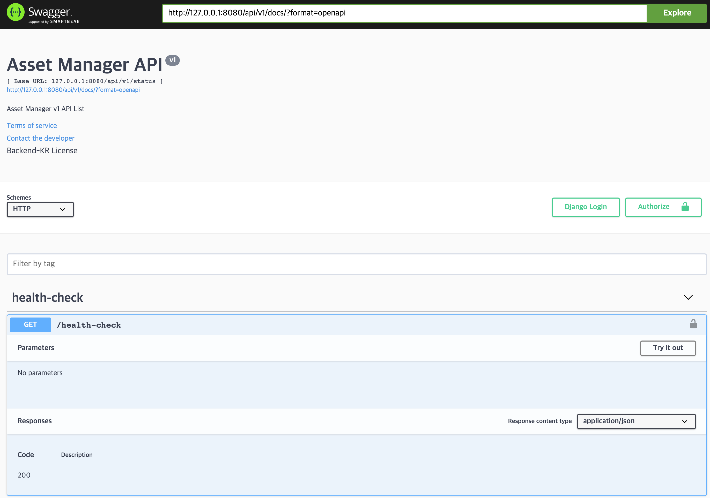

{: .no_toc }

## Table of contents
{: .no_toc .text-delta }

1. TOC
{:toc}

# 주의사항
본 시리즈는 최소한 장고 튜토리얼을 마친 사람을 대상으로 합니다. 개인적으로 토이 프로젝트를 진행하시는 분들과는 맞지 않을 수 있습니다.

이번 포스팅은 저희가 제공하는 예제 코드를 다룰 때 주의해야하는 부분들을 다룹니다. 마이그레이션 작업을 하신다면 반드시 아래 내용들을 확인한 후 사용하세요. 별거 아닌 문제로 하루가 사라질 수 있습니다.

# 시작
DJango tutorial을 보면 manage.py를 통해 프로젝트나 앱을 시작하는 게 일반적입니다. 이건 그저 장고가 제공해주는 편의 기능일 뿐 굳이 사용하지 않아도 됩니다.
자신만의 프로젝트를 하나 만들어두고 템플릿처럼 사용하는 게 효율적입니다. 앱을 추가할 때도 마찬가지고요. 마법사를 거치지 않으면 직접 설정을 해줘야하므로 번거롭지만 장고에 대한 이해가 올라갑니다. 이 문서에서는 앞으로 다룰 프로젝트의 뼈대 구조를 잡고 그에 대해 설명합니다.

# 준비 사항
이 글을 보시는 각자의 개발환경은 중요하지 않습니다. Windows, MacOS, Linux 무엇이든 상관없습니다.  
다만 Pycharm이나 VSCode 같은 개발환경은 각자 잘 준비하시길 바랍니다. 소스코드는 아래 주소에서 구할 수 있습니다.

> - Source Code : [https://github.com/backend-kr/asset-manager](https://github.com/backend-kr/asset-manager)

# 디렉토리 계층 구조
{:height="500px" width="300px"}

계층 구조 설계는 아주 중요합니다. 고려해야 할 포인트는 세 가지입니다.  

1. API 관리
2. 배포 환경 분리(개발계, 검증계, 운영계)
3. 기능 확장성

위 세 가지를 만족하는 프로젝트 구조만 한 번 잡아두면 계속해서 재활용할 수 있으며 개발할 때 구조를 신경 쓰지 않아도 됩니다.
이 문서에서 제시하는 구조는 하나의 사례일 뿐이니 위 조건들을 만족한다면 어떤 구조든 좋습니다.

# 비즈니스 로직의 관리
DJango에서는 기본적으로 비즈니스 로직을 관리하는 하나의 방법을 제시하지 않습니다.

> - [https://forum.djangoproject.com/t/where-to-put-business-logic-in-django/282/8](https://forum.djangoproject.com/t/where-to-put-business-logic-in-django/282/8)

비즈니스 로직을 어디에다 둘 것이냐는 장고 프로젝트를 진행하면서 항상 고민되는 부분입니다. 위 주소에서도 알 수 있죠. 
결론적으로 정답은 없습니다. 몇 가지 practice가 존재하지만, 그보다는 개발하는 서버의 특성이 더 중요합니다.

예를들어 API Gateway 서버를 만든다면 API 확장성을 고려해야합니다. 비즈니스 로직이 거의 없기 때문에 따로 레이어를 구축하지 않아도 됩니다.
하지만 로직이 많이 들어간다면 레이어의 분리를 심각하게 고민해야하겠죠.  본인이 만드는 서버의 특징을 잘 살펴보는 것이 가장 중요합니다.

앞으로 다룰 프로젝트는 하나의 서버가 많은 기능을 가질 것이 예상되므로 별도의 서비스 레이어를 추가할 것입니다.
아래는 해당 이슈에 대해서 참조하면 좋은 프로젝트 주소입니다.

> - [https://github.com/phalt/django-api-domains/](https://github.com/phalt/django-api-domains/)
> 
> - [https://github.com/dgk/django-business-logic/](https://github.com/dgk/django-business-logic/)

자, 이제 소스코드에 대해 살펴봅시다.

# 배포 환경에 따라 설정 파일을 분리하자
```python
#asset_manager/settings/__init__.py

import os

# 실행 환경 변수 값을 가져옵니다. 개발 편의성을 위해 기본값은 local로 설정합니다.
# 실제 배포할 때는 RUNNING_ENV를 계에 맞춰서 설정합니다.
RUNNING_ENV = os.getenv('RUNNING_ENV', 'local')

try:
    # exec 는 문자열을 코드로 해석해서 실행합니다. 
    exec('from .{} import *'.format(RUNNING_ENV))
except ImportError:
    # 예외 케이스가 발생할 경우 base만 import 합니다.
    from .base import *
```

> exec docs
> - [https://docs.python.org/3/library/functions.html#exec](https://docs.python.org/3/library/functions.html#exec)

우리는 로컬, 개발, 검증, 운영 4개의 계를 다룹니다. 각각의 계는 목적과 보안의 수준이 다릅니다. 그러니 배포지에 맞춰서 다른 설정 파일을 import 하는 기능이 필요합니다.
실행 시 설정할 RUNNING_ENV에 따라서 다른 파일을 import 합니다. 각 설정파일은 배포 환경에 맞는 설정값을 가집니다. 설정값을 나눠보면 아시겠지만, 대부분이 공통으로 사용하는 값입니다. 공통 값은 base.py에 넣습니다.

먼저 local.py 부터 살펴봅시다. 로컬 개발 환경은 편한 게 최곱니다. 보안은 신경쓰지말고 뭐든 허용해줍니다.
다만, 그렇게되면 *실제 배포 시에 다른 동작을 할 수 있다는 것을 항상 염두에 두어야합 니다!*

이 이슈에 대한 자세한 설명은 아래 주소를 참고하세요.

> - [https://simpleisbetterthancomplex.com/tips/2017/07/03/django-tip-20-working-with-multiple-settings-modules.html](https://simpleisbetterthancomplex.com/tips/2017/07/03/django-tip-20-working-with-multiple-settings-modules.html)


```python
#asset_manager/settings/local.py

from .base import *
from .default import *


DEBUG = True

ALLOWED_HOSTS = ['*']
CORS_ORIGIN_ALLOW_ALL = True
CORS_ALLOW_CREDENTIALS = True

DATABASES = get_secret('DATABASES')
```

개발 편의를 위해 Debug를 켜고 나머지 옵션도 편하게 잡습니다.  
Debug를 켜면 추가적인 정보를 확인할 수 있습니다. 마찬가지로 ALLOWED_HOSTS는 어디서든 접근할 수 있게 다 열어 줍시다.

Database 설정은 환경에 따라 다른 DB를 사용할 것이기 때문에 설정값을 secrets.json으로 분리한 다음 가져옵니다.
secrets.json에서 읽어오는 부분은 공통이므로 base.py에 넣습니다.

```python
#asset_manager/settings/base.py

with open(os.path.join(SETTINGS_DIR, 'secrets.json'), encoding='utf-8') as f:
    secrets = json.loads(f.read())

def get_secret(setting):
    try:
        return secrets.get(setting) \
            if secrets.get(setting, None) \
            else (getattr(global_settings, setting)
                  if hasattr(global_settings, setting)
                  else eval(setting)
                  )
    except KeyError:
        error_msg = "Set the {} environment variable".format(setting)
        raise ImproperlyConfigured(error_msg)
```
```python
#asset_manager/settings/secrets.json

{
  "SECRET_KEY": "uxkw4xaj*75bnt+4x))ss2$-2j8746lc(b*&la#)@-ggjd3&6%",
  "DATABASES": {
    "default": {
      "ENGINE": "django.db.backends.sqlite3",
      "NAME": "db.sqlite3"
    }
  }
}
```

코드 저장소에 올릴 수 없는 민감 데이터는 모두 secrets.json으로 분리합니다. 원격 저장소에도 올리지 않고 배포지에서 별도 관리합니다. 계정 정보가 들어가기 때문에 잘 관리해야 합니다.

Database의 기본값은 local 세팅으로 가정하고 sqlite3를 사용합시다. 당장은 어떤 DB를 사용하든 아무 상관이 없습니다. 이후에 mysql을 docker로 올려서 연결해봅시다.

```python
#asset_manager/manage.py

#!/usr/bin/env python
import os
import sys

if __name__ == "__main__":
    os.environ.setdefault("DJANGO_SETTINGS_MODULE", "asset_manager.settings")
    try:
        from django.core.management import execute_from_command_line
    except ImportError as exc:
        raise ImportError(
            "Couldn't import Django. Are you sure it's installed and "
            "available on your PYTHONPATH environment variable? Did you "
            "forget to activate a virtual environment?"
        ) from exc
    execute_from_command_line(sys.argv)
```

장고에서 여러 가지 기능을 제공해주는 manage.py 스크립트입니다. DJANGO_SETTINGS_MODULE 환경 변수를 설정해야 하는데, 배포 환경별로 나눈 상태이기 때문에
settings 폴더로 잡아줍니다. 사실상 asset_manager.settings.__init__.py로 잡는 것과 같습니다. init 파일에는 위에서 작성해둔 RUNNING_ENV에 따라
다른 파일을 import 하는 코드가 들어있습니다. 여기까지 진행하면 계 분리는 완료입니다. 모든 부분을 다루진 않기 때문에 제공하는 소스 코드를 참고해주세요.

# API 관리
API 문서화는 귀찮습니다. 하지만 안 할 수는 없죠. 문서화 도구를 잘 활용해서 프론트엔드가 좋아하는 개발자가 돼봅시다.

버전 관리는 간단합니다. 계층 구조에 version 값을 끼워 넣으면 되죠, 오랜 시간 유지보수를 하게 된다면 꽤 중요한 요소입니다.  
그보다 더 중요한 것은 분류 기준입니다. 도메인별로 나눌 것인지, 기능별로 나눌 것인지 잘 고려해야 합니다. 이 또한 다루고 있는 서비스에 대해 잘 이해하고 기능 간의 종속성을 파악하고 있어야 가능합니다. 이런 종류의 문제는 하나의 정답이 존재하지 않습니다. 상황에 맞게 합리적인 선택이 필요합니다.

본 프로젝트에서는 API의 문서화를 위해서 Swagger를 사용합니다. API가 추가될 때마다 별도의 작업을 하지 않아도 자동으로 문서화 되도록 준비해놓습니다.
물론 마법은 없기 때문에 계층 구초에 맞게 디렉토리르 검색해서 urlpattern을 생성하고 추가합니다.

아래 코드는 버전 정보 아래 폴더가 마지막 레벨이므로 아래와 같이 탐색합니다. 만약 계층 구조를 다르게 잡으셨다면 아래 코드도 달라져야 합니다.
아래 코드도 복잡해 보이지만 디버그 모드로 실행해서 한 줄씩 따라가면 쉽게 해석 가능한 코드입니다.

```python
#asset_manager/api/urls.py

folder = os.path.join(os.path.dirname(os.path.realpath(__file__)), 'versioned')

urlpatterns = []
version_map_dict = {}
for path, dirs, files, in os.walk(folder):
    depth = path[len(folder) + len(os.path.sep):].count(os.path.sep)
    if path != folder and depth == 1 and 'urls.py' in files:
        version, api_name = path.split(os.path.sep)[-2:]

        if not version_map_dict.get(version, None):
            version_map_dict[version] = []

        _include = 'api.versioned.{}.{}.urls'.format(version, api_name)

        urlpatterns.append(url(r'^api/' + version + '/' + api_name + '/', include(_include)))
        version_map_dict[version].append(url(r'^' + api_name + '/', include(_include), name=_include))


if settings.DEBUG:
    for version, patterns in version_map_dict.items():
        title = 'Asset Manager API'
        base_url = '/api'
        sv = get_schema_view(
            openapi.Info(
                title=title,
                default_version=version,
                description=f"Asset Manager {version} API List",
                terms_of_service="https://www.google.com/policies/terms/",
                contact=openapi.Contact(email="junpark4395@gmail.com"),
                license=openapi.License(name="Backend-KR License"),
            ),
            permission_classes=(permissions.AllowAny,),
        )
        urlpatterns = [url(r'^api/' + version + '/docs/$', sv.with_ui('swagger', cache_timeout=300)),] + urlpatterns
```

문서화 기능은 절대 운영환경에서 사용해서는 안 됩니다. 여기서는 DEBUG값이 활성화된 경우에만 Swagger를 사용합니다.
Swagger에 대해서는 이후에 따로 한 번 다룰 예정입니다. 막강한 편의 기능들을 많이 제공하니 반드시 사용하는 것을 추천합니다.

이 좋은 도구를 사용해서 해당 url에 접근해보면 그럴듯한 화면을 볼 수 있습니다.



이미지에서 보이는 health-check API는 테스트 용도로 작성해둔 간단한 API 입니다.

```python
#asset_manager/api/versioned/v1/status/urls.py

from django.conf.urls import url
from .views import HealthCheckView

urlpatterns = [
    url(r'^health-check$', HealthCheckView.as_view())
]

```

이후에 한 번에 다룰 예정이지만 url과 view가 매칭되어 HTTP 요청이 아래의 view로 전달됩니다.
view를 공부하면 재밌는 것들을 많이 할 수 있습니다. 기대해주세요.

```python
#asset_manager/api/versioned/v1/status/views.py

from rest_framework.request import Request
from rest_framework.response import Response
from rest_framework.permissions import AllowAny
from rest_framework.status import HTTP_200_OK
from rest_framework.views import APIView


class HealthCheckView(APIView):
    """
    status: 상태 체크

    상태 체크용 API 입니다.
    """

    # 테스트용 API이니 모든 접근을 허용합니다.
    permission_classes = [AllowAny, ]

    # get 요청을 처리합니다.
    def get(self, request: Request, *args, **kwargs) -> Response:
        return Response(status=HTTP_200_OK)

```
요청을 받으면 별도 처리 없이 200 응답을 내리는 코드입니다. 당분간은 API 추가가 없을 것입니다.

# 기능 확장
조금 있으면 도메인 별로 앱이 추가되고 그에 따른 여러 코드들이 모두 bases 아래에 들어갑니다. 프로젝트의 코어라고 생각하시면 됩니다.

common 폴더에는 프로젝트 전체에서 공통으로 사용하는 코드들이 들어갑니다. 대표적으로 Exception 관리, 유틸리티 함수 등이 해당됩니다. 또한 미들웨어 성격의 코드도 들어갈 예정이니 막다루면 안됩니다.

# 마무리
이제 도커 설정만 보면 프로젝트 셋업은 거의 완료네요. 아참 그리고 DB Migration 작업도 남았습니다. 둘 다 만만치 않은 주제이므로 다음 포스팅에서 다룰 예정입니다. 실제 모델을 추가하고 개발을 하는 건 언제가 될지 모르겠군요.

이번에 통째로 날려먹은 HTTP 요청의 처리 과정과 MVC(MTV) 패턴에 대해서는 그 다음 포스트에서 다룰 예정입니다. 

앞으로 다룰 주제들을 생각을 하면 막막하네요 ^^;; 
