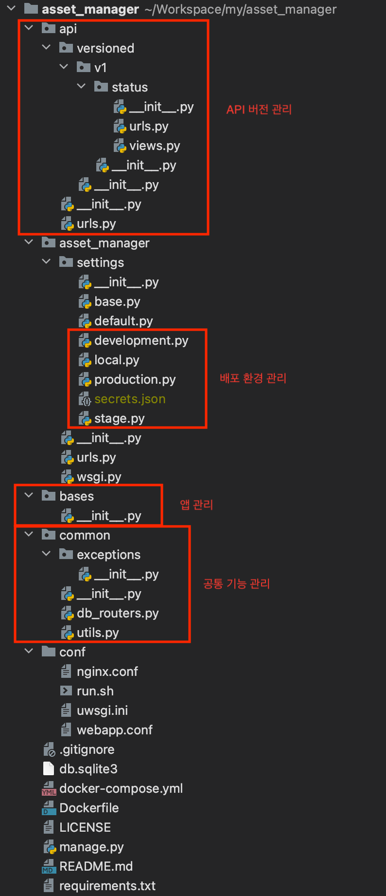

{: .no_toc }

## Table of contents
{: .no_toc .text-delta }

1. TOC
{:toc}

---
## 시작

DJango tutorial을 보면 manage.py를 통해 프로젝트나 앱을 시작하는 게 일반적입니다. 

이건 그저 장고가 제공해주는 편의 기능일 뿐 굳이 사용하지 않아도 됩니다.

자신만의 프로젝트를 하나 만들어두고 템플릿처럼 사용하는 게 효율적입니다. 앱을 추가할 때도 마찬가지고요. 

마법사를 거치지 않으면 직접 설정을 해줘야하므로 번거롭지만 장고에 대한 이해가 올라갑니다.

이 문서에서는 앞으로 다룰 프로젝트의 뼈대 구조를 잡고 그에 대해 설명합니다.

{: .note }
각 장마다 개발 `commit link`를 걸어두었습니다.

---

## 준비 사항

이 글을 보시는 각자의 개발환경은 중요하지 않습니다. Windows, MacOS, Linux 무엇이든 상관없습니다.  
다만 Pycharm이나 VSCode 같은 개발환경은 각자 잘 준비하시길 바랍니다. 

소스코드는 아래 주소에서 구할 수 있습니다.

> - Source Code : [https://github.com/backend-kr/asset-manager](https://github.com/backend-kr/asset-manager)

---

## 디렉토리 계층 구조
{:height="500px" width="300px"}

계층 구조 설계는 아주 중요합니다. 고려해야 할 포인트는 세 가지입니다.  

1. API 관리
2. 배포 환경 분리(개발계, 검증계, 운영계)
3. 기능 확장성

위 세 가지를 만족하는 프로젝트 구조만 한 번 잡아두면 계속해서 재활용할 수 있으며 개발할 때 구조를 신경 쓰지 않아도 됩니다.
이 문서에서 제시하는 구조는 하나의 사례일 뿐이니 위 조건들을 만족한다면 어떤 구조든 좋습니다.

---

## 비즈니스 로직의 관리
DJango에서는 기본적으로 비즈니스 로직을 관리하는 방식이 정형화되어있지 않습니다.

> - [https://forum.djangoproject.com/t/where-to-put-business-logic-in-django/282/8](https://forum.djangoproject.com/t/where-to-put-business-logic-in-django/282/8)

비즈니스 로직을 어디에다 둘 것이냐는 장고 프로젝트를 진행하면서 항상 고민되는 부분입니다. 위 주소에서도 알 수 있죠. 
결론적으로 정답은 없습니다. 몇 가지 practice가 존재하지만, 그보다는 개발하는 서버의 특성이 더 중요합니다.

예를들어 API Gateway 서버를 만든다면 API 확장성을 고려해야합니다. 비즈니스 로직이 거의 없기 때문에 따로 레이어를 구축하지 않아도 됩니다.
하지만 로직이 많이 들어간다면 레이어의 분리를 심각하게 고민해야하겠죠.  본인이 만드는 서버의 특징을 잘 살펴보는 것이 가장 중요합니다.

앞으로 다룰 프로젝트는 하나의 서버가 많은 기능을 가질 것이 예상되므로 별도의 서비스 레이어를 추가할 것입니다.
아래는 해당 이슈에 대해서 참조하면 좋은 프로젝트 주소입니다.

> - [https://github.com/phalt/django-api-domains/](https://github.com/phalt/django-api-domains/)
> 
> - [https://github.com/dgk/django-business-logic/](https://github.com/dgk/django-business-logic/)